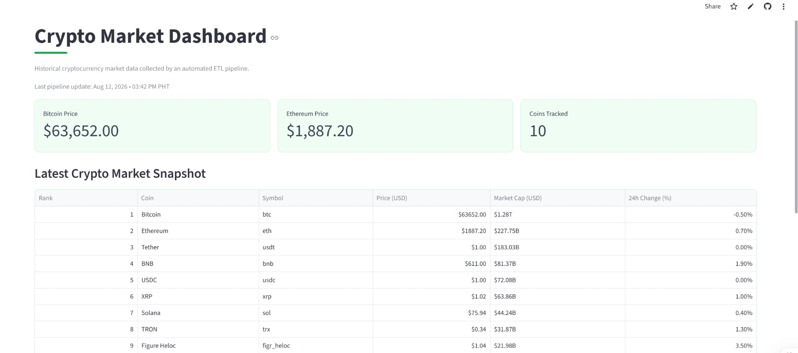

# Crypto ETL Pipeline

An automated end-to-end data engineering pipeline that extracts cryptocurrency market data from the CoinGecko API, transforms it using Python and Pandas, stores historical market snapshots in a cloud-hosted PostgreSQL database, and visualizes the data through a deployed Streamlit dashboard.

The ETL pipeline runs automatically every 6 hours using GitHub Actions.

## Live Dashboard

[View the Live Crypto Market Dashboard](https://crypto-etl-pipeline-4xccdqzyv5hr4qbdnwy5zz.streamlit.app/)

---

## Dashboard Preview



---

## Pipeline Architecture

```text
CoinGecko API
      |
      v
Python Extraction
      |
      v
Pandas Transformation
      |
      v
Supabase PostgreSQL
      |
      v
Historical Market Data
      |
      v
Streamlit Dashboard

Automation: GitHub Actions (Every 6 Hours)
```

## ETL Process

### 1. Extract

Cryptocurrency market data is retrieved from the CoinGecko `/coins/markets` API endpoint.

The pipeline currently extracts market data for the top 10 cryptocurrencies by market capitalization.

### 2. Transform

The API response is converted from JSON into a Pandas DataFrame.

The transformation process includes:

- Selecting relevant market fields
- Renaming columns for database readability
- Converting date fields to UTC timestamps
- Adding an extraction timestamp
- Preparing the dataset for PostgreSQL storage

### 3. Load

The transformed data is loaded into a PostgreSQL database hosted on Supabase.

The data is stored in:

`crypto_market_history`

Each pipeline execution creates a new historical snapshot of cryptocurrency market data.

A database constraint and PostgreSQL conflict handling are used to prevent duplicate records for the same cryptocurrency and extraction timestamp.

### 4. Automate

GitHub Actions runs the ETL pipeline automatically every 6 hours.

The database connection string is stored securely using GitHub Secrets, allowing the pipeline to run in the cloud without requiring the local machine to remain online.

### 5. Visualize

A Streamlit dashboard connects to the Supabase PostgreSQL database and presents the collected market data.

The dashboard includes:

- Latest pipeline update
- Bitcoin price
- Ethereum price
- Number of cryptocurrencies tracked
- Latest crypto market snapshot
- Market capitalization
- 24-hour price changes
- Historical cryptocurrency price data

---

## Technologies Used

| Technology | Purpose |
|---|---|
| Python | ETL pipeline and application logic |
| Pandas | Data transformation |
| Requests | CoinGecko API requests |
| CoinGecko API | Cryptocurrency market data |
| PostgreSQL | Relational database |
| Supabase | Cloud-hosted PostgreSQL |
| SQLAlchemy | Database connection and operations |
| Psycopg | PostgreSQL database driver |
| GitHub Actions | Pipeline automation |
| Streamlit | Web dashboard |
| Git & GitHub | Version control and project hosting |
| Jupyter Notebook | API exploration and development |

---

## Project Structure

```text
crypto-etl-pipeline/
|
|-- .github/
|   `-- workflows/
|       `-- pipeline.yml
|
|-- notebooks/
|   `-- api_exploration.ipynb
|
|-- screenshots/
|   `-- dashboard.png
|
|-- sql/
|   `-- create_table.sql
|
|-- src/
|   `-- pipeline.py
|
|-- app.py
|-- .gitignore
|-- requirements.txt
`-- README.md
```

Local environment files, database credentials, virtual environment files, and runtime logs are excluded from version control.

---

## Database

The PostgreSQL database stores historical cryptocurrency market information including:

- Cryptocurrency ID and symbol
- Cryptocurrency name
- Current price
- Market capitalization
- Market cap rank
- Trading volume
- 24-hour high and low
- 24-hour price change
- Circulating, total, and maximum supply
- All-time-high information
- Source update timestamp
- Pipeline extraction timestamp

The database schema is available in:

`sql/create_table.sql`

---

## Automation

The pipeline is automated using GitHub Actions.

```text
Every 6 hours
     |
     v
GitHub Actions
     |
     v
Run Python ETL Pipeline
     |
     v
Fetch CoinGecko Data
     |
     v
Transform with Pandas
     |
     v
Load into Supabase PostgreSQL
     |
     v
Streamlit Dashboard reads updated data
```

The PostgreSQL connection string is stored as a GitHub repository secret and is never exposed in the source code.

---

## Logging and Error Handling

The pipeline uses Python's logging module to record pipeline execution information.

Logs include:

- Pipeline start and completion
- Number of records extracted
- Number of records transformed
- Successful database loads
- Pipeline failures and exception tracebacks

Exception handling is implemented to capture pipeline failures and provide useful debugging information.

---

## Running the Project Locally

### 1. Clone the repository

```bash
git clone https://github.com/Karlaqu123/crypto-etl-pipeline.git
cd crypto-etl-pipeline
```

### 2. Create a virtual environment

```bash
python -m venv venv
```

Activate the virtual environment on Windows:

```bash
venv\Scripts\activate
```

### 3. Install dependencies

```bash
pip install -r requirements.txt
```

### 4. Configure the database connection

Create a `.env` file in the project root:

```text
DATABASE_URL=your_postgresql_connection_string
```

The `.env` file is excluded from version control using `.gitignore`.

### 5. Create the database table

Run:

`sql/create_table.sql`

in your PostgreSQL database.

### 6. Run the ETL pipeline

```bash
python src/pipeline.py
```

### 7. Launch the dashboard

```bash
streamlit run app.py
```

---

## Key Learnings

This project provided hands-on experience with:

- Building an end-to-end ETL pipeline
- Extracting data from a REST API
- Transforming semi-structured JSON data with Pandas
- Loading historical data into PostgreSQL
- Working with a cloud-hosted PostgreSQL database
- Managing database connections with SQLAlchemy
- Preventing duplicate database records
- Managing credentials with environment variables and GitHub Secrets
- Implementing logging and error handling
- Automating recurring ETL jobs with GitHub Actions
- Building a data dashboard with Streamlit
- Deploying a public data application
- Using Git and GitHub for version control

---

## Future Improvements

Potential improvements include:

- Track additional cryptocurrencies
- Add automated data quality checks
- Add pipeline failure notifications
- Expand historical trend analysis
- Add more interactive dashboard visualizations